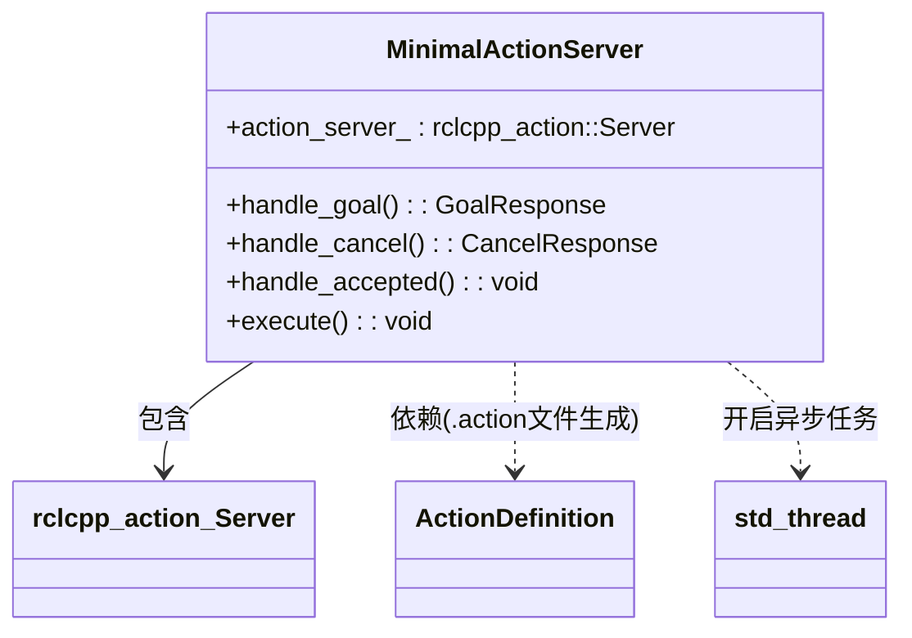
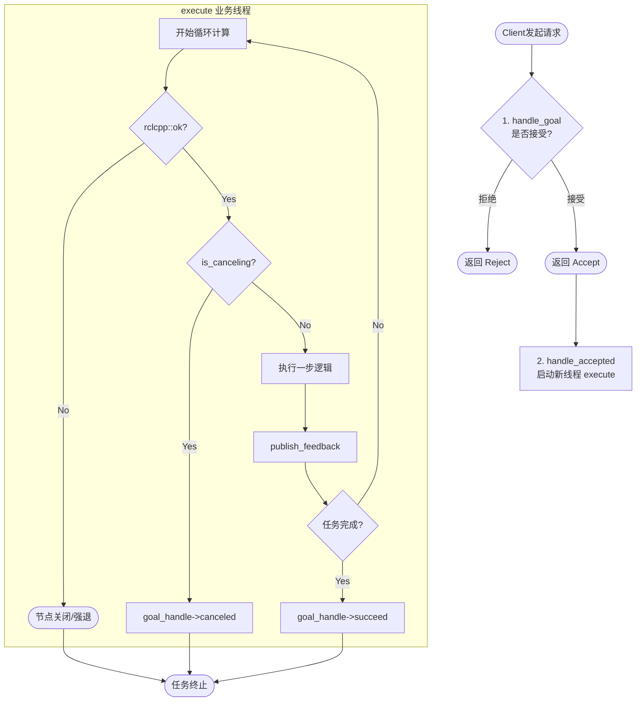

要构建一个健壮的 Action Server，不能只考虑“正常运行”，还必须包含**目标判定、异步执行、状态反馈、以及异常中断（Ctrl+C/Cancel）**。

以下是通过 Mermaid 梳理的 Action Server 完整逻辑架构：

### 1. 静态结构图 (Class Composition)

描述 Action Server 类内部有哪些关键成员。

---

### 2. 动态逻辑流程图 (The "Must-Have" Logic)

这是 Action Server 运行时的标准逻辑全景，包含了你关心的 **Ctrl+C** 和 **取消** 处理。

---

### 3. 必要组成部分清单 (Summary)

根据上述图表，一个“合格”的极简 Action Server 必须具备以下 **5 个核心要素**：

1. **接口定义 (Interface)**：
* 必须包含 `.action` 生成的头文件，明确 `Goal`, `Feedback`, `Result` 的数据结构。

2. **三大回调 (The Three Callbacks)**：
* `handle_goal`：门卫，决定接不接活。
* `handle_cancel`：策略，决定让不让取消（通常直接返回 `ACCEPT`）。
* `handle_accepted`：分流器，**绝对不能**在这里写耗时逻辑，必须在此启动新线程或交给线程池。

3. **异步执行器 (Asynchronous Executor)**：
* 通常是一个 `std::thread` 或 `rclcpp::Timer`，用来承载 `execute` 函数，避免阻塞 ROS 2 主循环（Spin）。

4. **状态自检 (State Self-Check)**：
* **关键点**：在 `execute` 循环中，必须不断检查 `rclcpp::ok()`（应对 Ctrl+C）和 `goal_handle->is_canceling()`（应对用户手动取消）。

5. **终态反馈 (Final Notification)**：
* 逻辑结束时，必须调用 `succeed()`、`canceled()` 或 `abort()`，否则 Client 会一直处于等待状态，造成资源泄漏。

**你现在是否想把这个逻辑拆分到 .hpp 和 .cpp 中，做一个符合工业标准的 Action Server 示例？**